# WinArcadia with RetroAchievements guide

Welcome, this is a quick guide to help RetroAchievements players get started with WinArcadia.

You can download WinArcadia from Amigan Software's releases page here: 
https://amigan.1emu.net/releases/ 
This guide was made using version 29.4.

## Options

Here are some basic options you may want to be aware of first.

### Graphics size/Window size

To change this, go to Options -> Graphics. The default is 3x size.

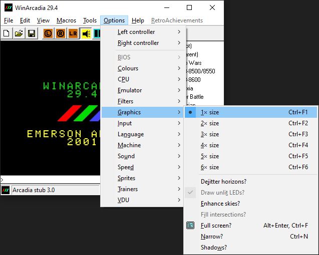

The full screen option is also in this menu. It can also be activated by double clicking on the menu bar. If you did this by accident, you can right click to bring up the menu and go to Options -> Graphics. The keyboard shortcuts Alt + Enter or Ctrl + F can be used as well.

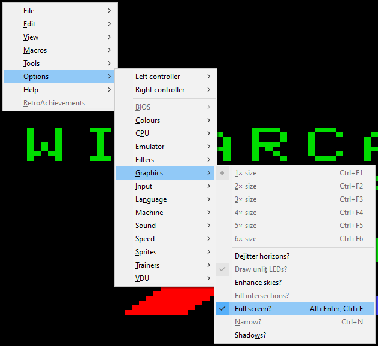

### Hiding the sidebar

The sidebar is handy for switching between games, but it can lead to accidents as well, since it only takes a single click to load a game. If you want to hide the sidebar, the option is under View -> Sidebar.

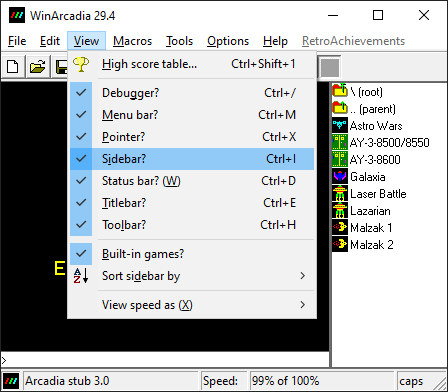

### Hiding the pointer

You probably don't want this, but it can happen by accident. If you've found that your pointer is missing, the option is under View -> Pointer. The shortcut is Ctrl + X, so it may happen if you're trying to cut & paste text while the WinArcadia window is in focus.

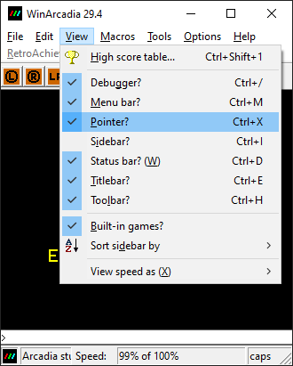

### Machine choice

WinArcadia emulates many different systems. The one that starts by default is the Emerson Arcadia 2001 - you can see its startup screen in this screenshot. The icon in the bottom left of the status bar also shows the current machine.

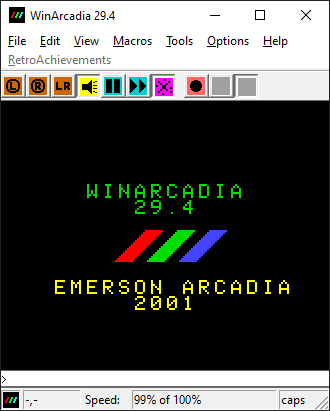

To change the current machine, go to Options -> Machine:

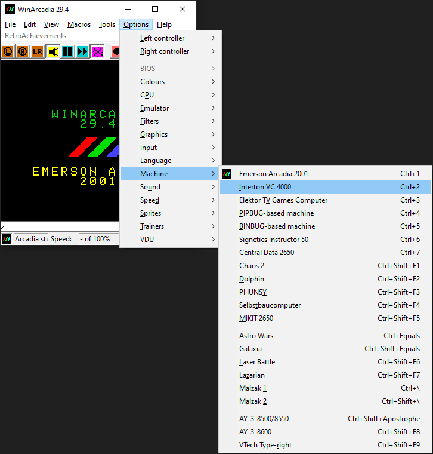

Emerson Arcadia 2001, Interton VC 4000, and Elektor TV Games Computer are the ones currently supported by RetroAchievements.

Normally changing the machine in this way may not be necessary, since WinArcadia has a database of recognized games, and will automatically switch to the appropriate machine when you open a game. However, there is currently an issue with the RetroAchievements integration where the game's achievements might not work properly when you do this. This will be explained later.

## RetroAchievements

When you're ready to continue, you can log in under Tools -> RetroAchievements. 

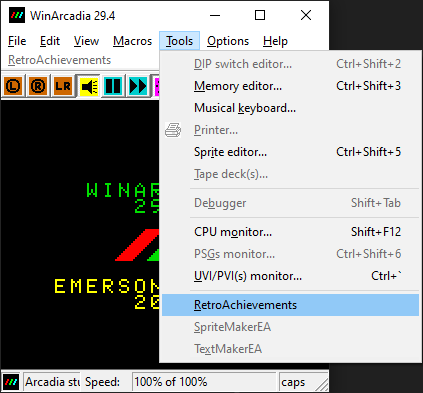

The problem is you may get an error 12007 or 12005:

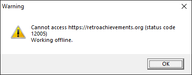

Unfortunately this has been happening to me a lot lately, and I don't know a way around it besides waiting and trying again later. It may be an issue with RetroAchievements itself rather than WinArcadia. Sometimes closing and re-opening WinArcadia may work, but that might also give another 12005 error.

If you get past it, you can then log in like normal. You may also get a window asking if you want to upgrade the RetroAchievements toolset (choose Yes).

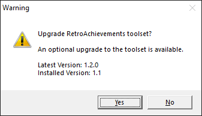

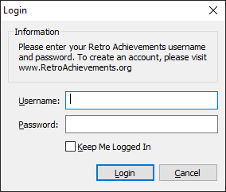

You can then access the RetroAchievements menu, where you can enable or disable Hardcore Mode and Leaderboards. Overlay Settings has additional customization for achievement and leaderboard notifications, etc. Most of the other options in the menu are only for developers.

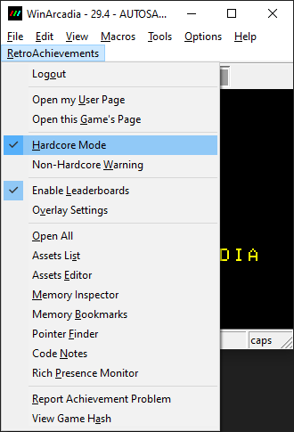

### Ensuring that achievements work correctly

As mentioned earlier, unfortunately there is currently an issue where a game's achievements might not work properly. This happens when you have one machine loaded (say Emerson Arcadia 2001, the default), then you directly open a game for a different machine, say Interton VC 4000.

Without getting into any more detail, to avoid this issue and ensure the achievements work, always follow these exact steps in order:

1. Options -> Machine -> Choose either Emerson Arcadia 2001, Interton VC 4000, or Elektor TV Games Computer, depending on the game you want to play.

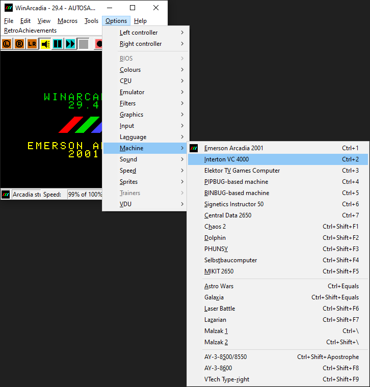

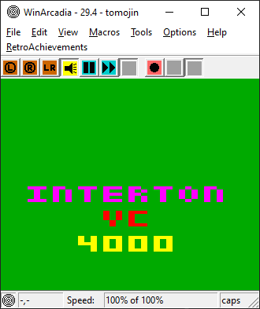

2. Tools -> Disable RetroAchievements, then Tools -> Enable it again. This is the most important step to make sure the achievements work properly. (Unfortunately this is where error 12007 or 12005 may get in the way again)

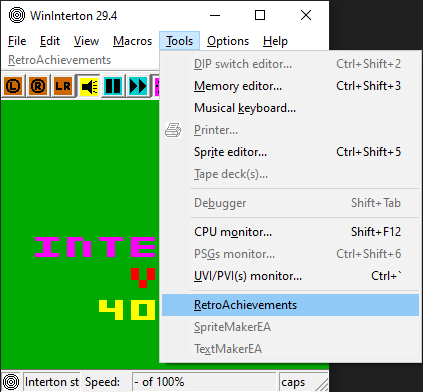

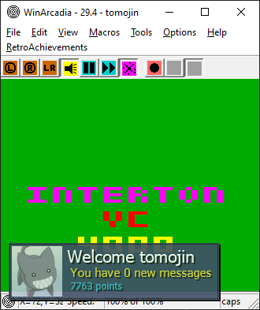

3. File -> Open the game for the machine you chose in step 1.

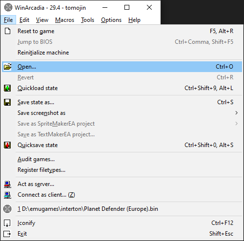

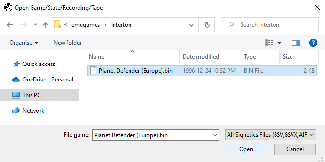

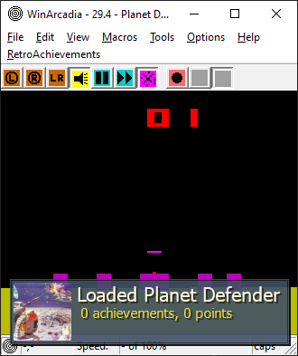

If you later want to play a game for a different machine, you must go through steps 1 and 2 again.

## Game information and controls

Usually you can find some information on a game under Help -> Game information.

Keyboard controls can be found under Help -> Host keyboard.

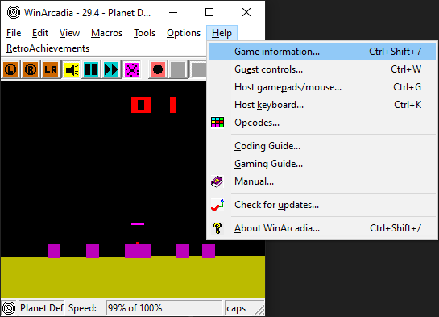

Some games have manuals with additional information. You can download manuals and other materials from Amigan Software's Emerson Arcadia 2001 Central:

https://amigan.yatho.com/